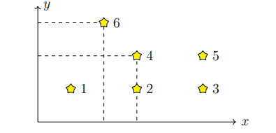

# Задача 36. Звёздочки

- **Имя входного файла:** input.txt
- **Имя выходного файла:** output.txt
- **Ограничение по времени:** 1 с
- **Ограничение по памяти:** нет

На карте звёздного неба каждая звезда имеет координаты $(x, y)$ в декартовой системе. Определим уровень звезды как количество других звёзд, которые расположены не выше и не правее данной звезды. Требуется посчитать число звёзд каждого уровня.

## Формат входных данных

Первая строка содержит целое число $n$ ($1 \le n \le 300\,000$) — количество звёзд.

Далее следуют $n$ строк, в $i$-й из которых записаны два целых числа $x$ и $y$ ($0 \le x, y \le 500\,000$) — координаты $i$-й звезды. Звёзды отсортированы по возрастанию $y$, а при равных $y$ — по возрастанию $x$. Все координаты различны.

## Формат выходных данных

Выведите $n$ строк: в $i$-й строке должно быть количество звёзд уровня $i$ (уровни нумеруются с нуля).

## Полезный комментарий

Компилятор: Microsoft Visual C++ 15.9 (2017) x64.

Чтобы ускорить ввод-вывод, добавьте:

```cpp
int main() {
    ios::sync_with_stdio(false);
    cin.tie(nullptr);
}
```

## Пример

**Ввод (`input.txt`)**

```text
6
1 1
3 1
5 1
3 2
5 2
2 3
```

**Вывод (`output.txt`)**

```text
1
2
2
0
1
0
```

## Замечание


На иллюстрации к примеру уровень звезды 6 равен 1, а уровень звезды 4 равен 2.
