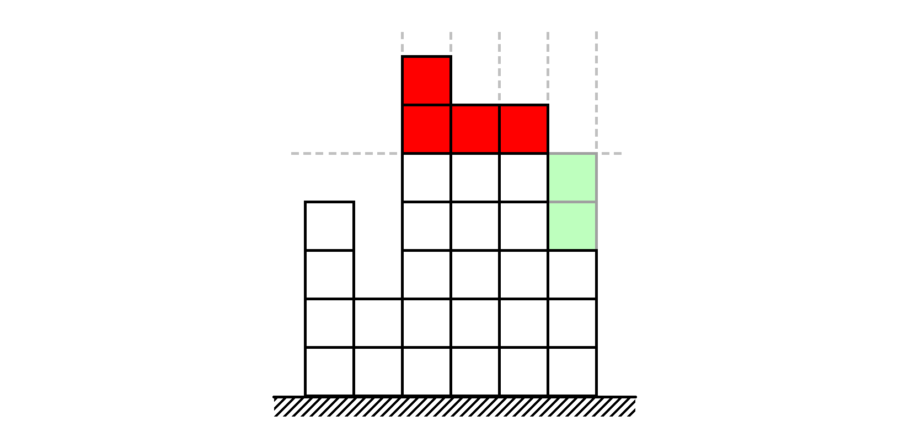

Задача Реконструкция крепостной стены
    
    
        Имя входного файла: стандартный ввод
        Имя выходного файла: стандартный вывод
        
            Ограничение по времени: 2 с
        
        
            Ограничение по памяти: 1024 МБ
        

В древности люди возводили вокруг своих городов крепостные стены для защиты от нападений извне. 
Когда к городу подбирался супостат, городские ворота закрывались, и неприятелю ничего не оставалось, кроме как лезть на стену. 
А наверху его уже поджидали разъярённые защитники города, встреча с которыми не сулила ничего хорошего.
Со временем города разрастались настолько, что внутри крепостных стен становилось тесно. 
Поэтому стены понемногу начали разбирать. 
В наши дни в мире осталось не так уж много городов, сохранивших хотя бы часть бывших крепостных стен. 
Конечно, защитной функции они уже не несут, зато имеют историческую ценность и обеспечивают приток туристов в страну и налогов в казну.В Министерстве архитектуры и строительства предложили реконструировать древнюю крепостную стену в одном из культурных центров страны. С течением веков стена изрядно пострадала, а кое-где и вовсе разрушилась. Перед реставрацией важно оценить стоимость работ.Крепостную стену можно представить в виде $n$ подряд идущих вертикальных столбов, для удобства пронумерованных от $1$ до $n$. Столб с номером $i$ имеет высоту $a_i$. Городские архитекторы предложили $q$ планов реставрации стены. План с номером $j$ заключается в том, чтобы сделать высоту всех подряд идущих столбов, пронумерованных от $\ell_j$ до $r_j$ включительно, одинаковой и равной $h_j$. Если высота столба меньше $h_j$, то предлагается нарастить его с помощью современных строительных материалов, а если больше $h_j$, то придётся разобрать часть кладки.Изменение высоты любого столба на $1$, как в сторону увеличения, так и в сторону уменьшения, стоит одну безусловную единицу. Подсчитайте для каждого из предложенных планов, сколько безусловных единиц стоит переделать фрагмент стены. Учитывайте, что это только планы и никаких реальных изменений со стеной при этом не происходит.Формат входных данныхПервая строка входных данных содержит два целых числа $n$ и $q$ ($1 \leqslant n, q \leqslant 300\,000$) — количество столбов в стене и количество планов.Вторая строка содержит $n$ целых чисел $a_1, a_2, \ldots, a_n$ ($1 \leqslant a_i \leqslant 10^9$) — высоты столбов.Далее следуют $q$ строк, $j$-я из которых содержит три целых числа $\ell_j$, $r_j$, $h_j$ ($1 \leqslant \ell_j \leqslant r_j \leqslant n$, $1 \leqslant h_j \leqslant 10^9$) — описание плана с номером $j$.Формат выходных данныхВыведите $q$ строк, $j$-я из которых содержит одно целое число — стоимость реконструкции стены в соответствии с $j$-м планом.

Компилятор
Microsoft Visual C++ 15.9 (2017) x64

Полезный коментарий

если кто-то вдруг как и я не понял почему не проходят тесты по времени а алгос вроде правильный, то подключите 2 строчки в main для того, чтоб код из-за вывода не замедлялся и всё должно заработать
int main(){
    ios::sync_with_stdio(false);
    cin.tie(nullptr);

Пример 1

стандартный ввод
4 3
3 1 1 2
1 4 1
1 4 2
1 4 3

стандартный вывод
3
3
5

Пример 2

стандартный ввод
6 5
4 2 7 6 6 3
2 4 7
3 6 5
1 5 1
2 6 8
1 4 3

стандартный вывод
6
6
20
16
9

Замечание

Обратите внимание на то, что в этой задаче входные и выходные данные могут иметь большой размер. Рекомендуем использовать методы ускорения чтения и записи данных, которые имеются в используемом вами языке программирования.На рисунке ниже приведена графическая иллюстрация второго примера с планом под номером $2$: высоту $3$-го столбца нужно уменьшить на $2$, $4$-го и $5$-го столбцов — на $1$, а высоту $6$-го столбца нужно увеличить на $2$, чтобы высоты всех этих столбцов стали равны $5$.